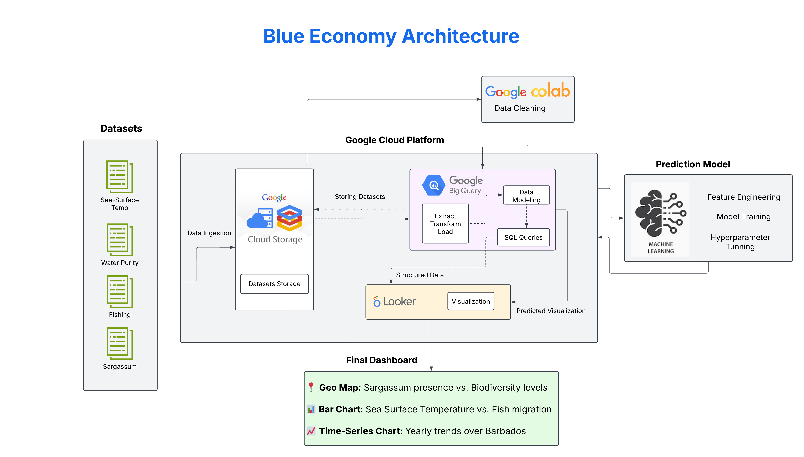

# 🌊 Blue Economy Project – Barbados (Google X Practicum)

This project is a data-driven collaboration with the Google X research team to explore key challenges and opportunities within the Blue Economy of Barbados by leveraging public ocean datasets to build an analytical platform that visualizes trends in marine biodiversity, fisheries, sea surface temperature, and sargassum impact—supporting sustainable coastal decision-making.

## 📊 Dashboard Link
[View Project Dashboard](https://lookerstudio.google.com/u/0/reporting/dbd416ff-d399-4cd3-a799-2efbecbe655a/page/p_vn4lrgfhrd)

## 🛠️ Architecture

## 📦 Datasets Used
- **Fisheries (1950–2022):** FAO FishStatJ global production
- **Sargassum:** NOAA chlorophyll concentration, NPP records
- **Sea Surface Temperature (SST):** Copernicus Marine Service (NetCDF format)
- **Biogeochemical Data (BBP):** Copernicus satellite records (1997–present)

## 🛠️ Tools & Technologies
- **BigQuery**: Data ingestion, transformation
- **Google Collab**: Efficient slicing/filtering of multidimensional NetCDF datasets 
- **Looker Studio**: Dashboarding and interactive visualization
- **Google Cloud Platform**: End-to-end data engineering

---

